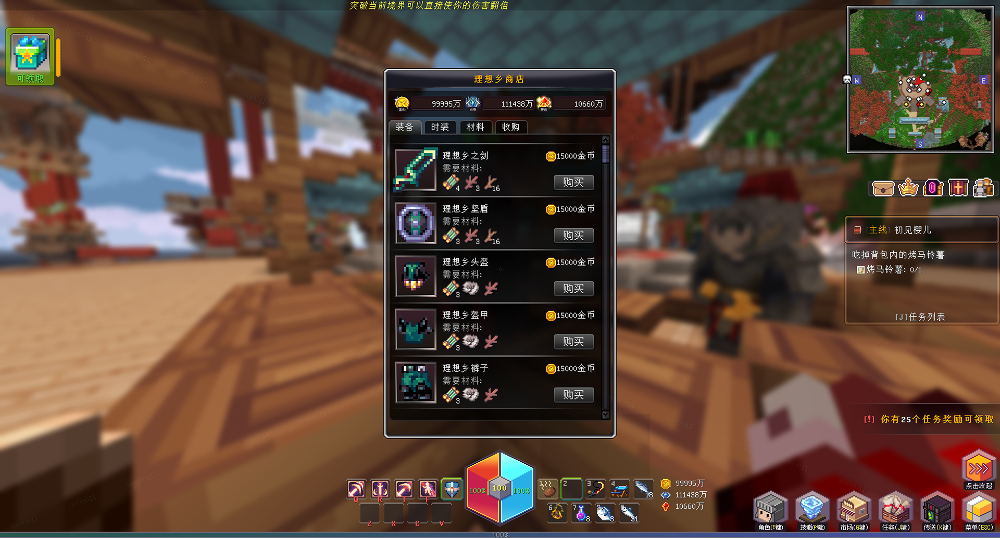
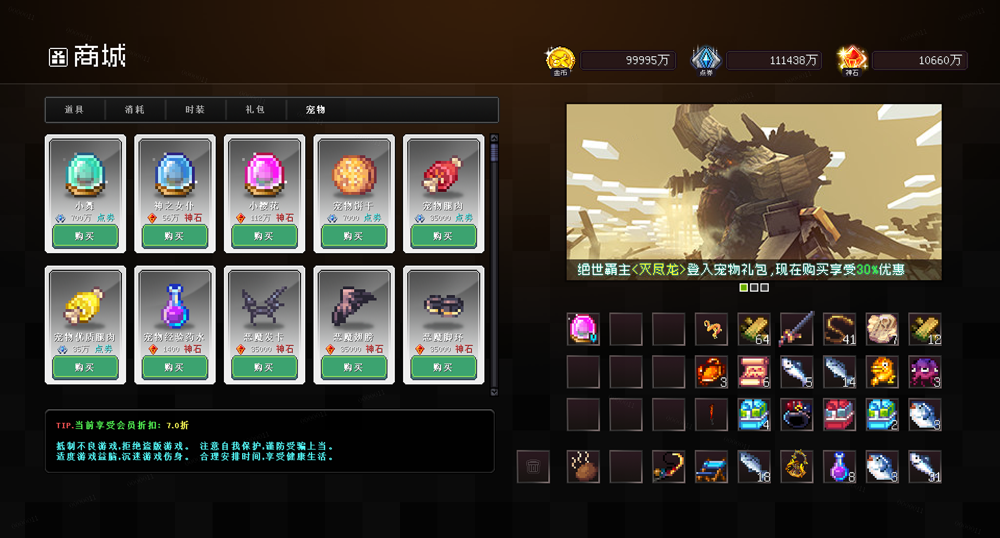

# JustStore

> 商人、商城系统





#### API
```yaml
`JustStoreAPI`

# 打开商店
openMerchant(Player player, String shopID);
openMerchant(Player player, String shopID, String shelfID);
# 打开商城
openStore(Player player, int id)
```

#### Event
```yaml
# 商城打开事件
StoreOpenEvent
  # 商城交易事件
StoreTradeEvent.Pre
StoreTradeEvent.Post
# 商店交易事件
ShopTradeEvent.Pre
ShopTradeEvent.Post
```
